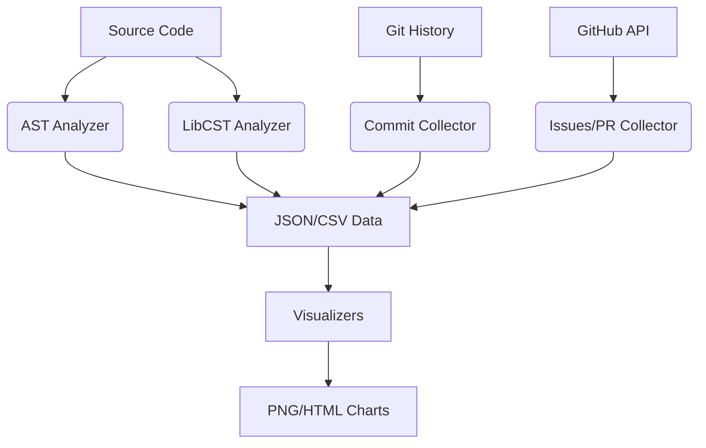

# Typer Repository Analyzer - Technical Documentation

## 1. Architecture Overview

The system is designed as a modular pipeline with three main stages:
1. **Collection**: Gathering raw data from Git, GitHub API, and source code.
2. **Analysis**: Processing raw data into structured insights using AST, LibCST, Z3, and PySnooper.
3. **Visualization**: Rendering insights into static (Matplotlib/Seaborn) and interactive (Plotly) charts.

## 2. Core Components

### 2.1 AST Analysis (`analyzers/ast_analyzer.py`)
- **Purpose**: Static analysis of Python abstract syntax trees.
- **Key Features**:
  - Function/Class extraction with metadata (line numbers, args, decorators).
  - Complexity calculation (McCabe cyclomatic complexity).
  - Call graph generation.
  - Import dependency tracking.
- **Optimization**: Uses a single-pass visitor pattern (`CodeVisitor`) to collect all metrics in one traversal.

### 2.2 Z3 Constraint Analysis (`analyzers/z3_analyzer.py`)
- **Purpose**: Formal verification of parameter constraints and logic paths.
- **Key Features**:
  - Symbolic execution of CLI parameter constraints.
  - Type compatibility verification (including Union types).
  - Callback path reachability analysis.
  - Satisfiability checking (SAT/UNSAT).

### 2.3 Dynamic Tracing (`analyzers/dynamic_tracer.py`)
- **Purpose**: Runtime behavior analysis using PySnooper.
- **Key Features**:
  - Execution path tracing with timestamped events.
  - Variable state monitoring.
  - Callback invocation logging.
  - Structured CSV export of trace data.

### 2.4 LibCST Type Analysis (`analyzers/libcst_analyzer.py`)
- **Purpose**: Precise syntax analysis for type hints.
- **Key Features**:
  - Type annotation coverage statistics.
  - Generic type usage analysis (List, Dict, Optional).
  - Syntax error handling.

## 3. Data Flow

## 4. Performance Considerations

- **Caching**: Implemented in `utils/cache.py` to prevent redundant API calls and re-processing of commits.
- **Batch Processing**: Commits are processed in chunks.
- **Lazy Loading**: Visualizers only load data when generating specific charts.
